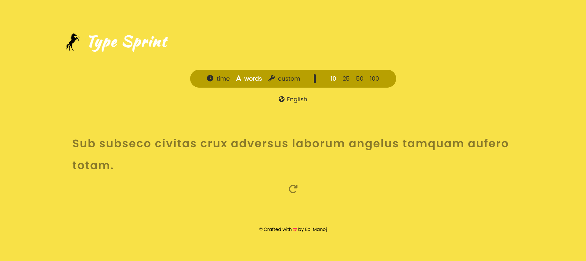

# TypeSprint

   <br/>

**TypeSprint** is a fun and interactive typing speed game built using modern web technologies like [Vite](https://vitejs.dev/), [JavaScript](https://developer.mozilla.org/en-US/docs/Web/JavaScript), The goal is to challenge users to type the displayed words as quickly as possible and improve typing speed over time.

## Features

- Interactive typing game interface with a timer.
- Real-time typing speed display.
- Random word generator for typing practice.

## Technologies Used

- **Frontend:**
  - [Vite](https://vitejs.dev/): Fast build tool and development server.
  - [JavaScript](https://developer.mozilla.org/en-US/docs/Web/JavaScript): Core scripting language for dynamic functionality.

## Screenshot

Here is a preview of the game interface:



## Getting Started

### Installation

1. Clone the repository.

   ```sh
   git clone https://github.com/yourusername/TypeSprint.git
   ```

2. cd TypeSprint

3. npm install

4. npm run dev

Open your browser and visit http://localhost:3000.

## License

This project is licensed under the MIT License - see the LICENSE file for details.

### Acknowledgements

Inspired by typing games and speed challenges.
Built with love and passion for web development!
